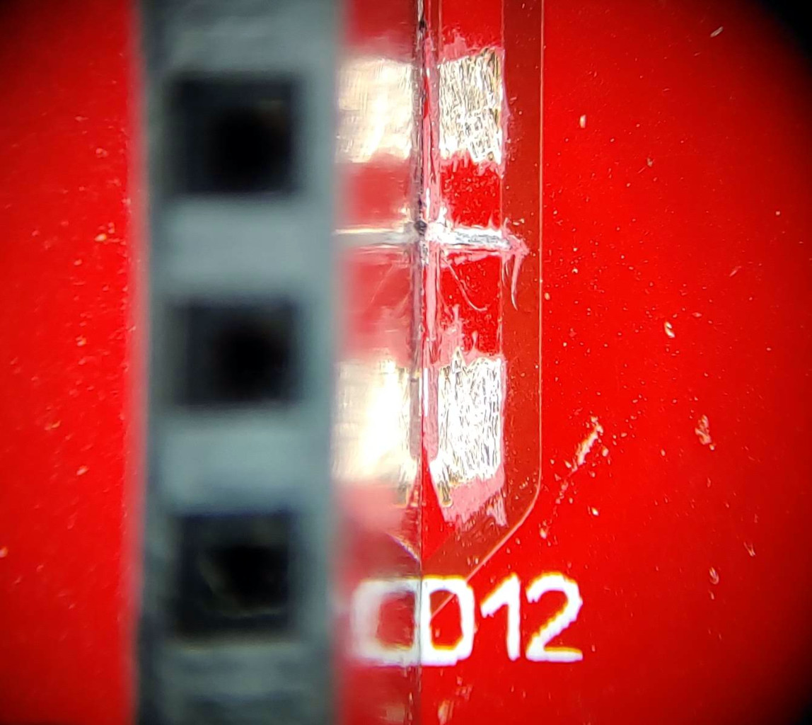
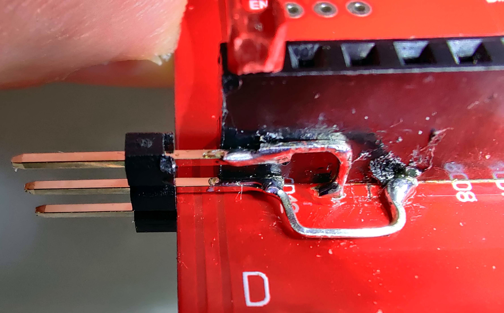
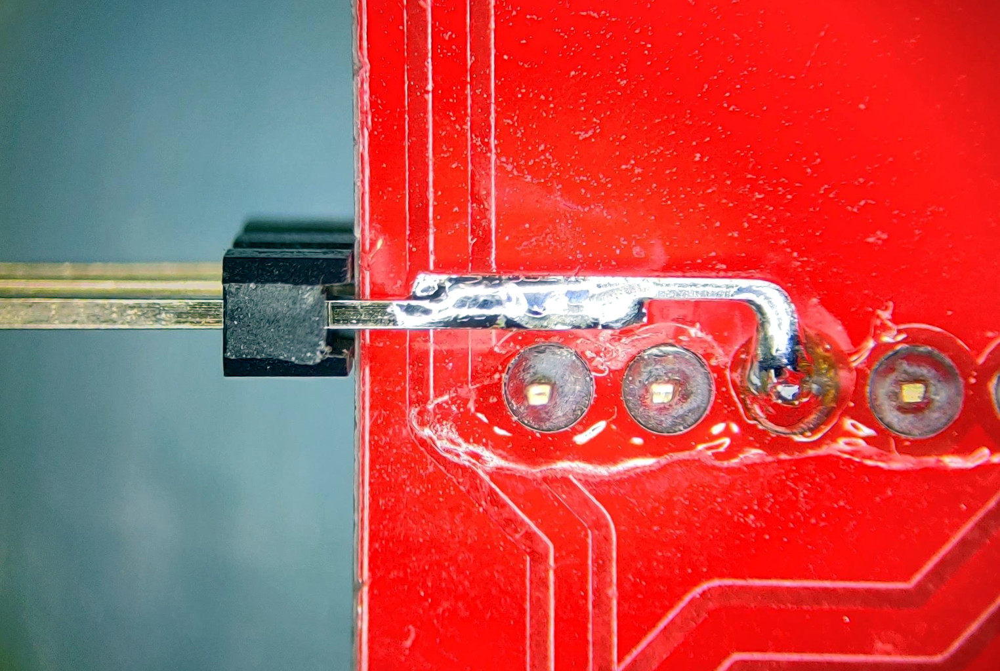
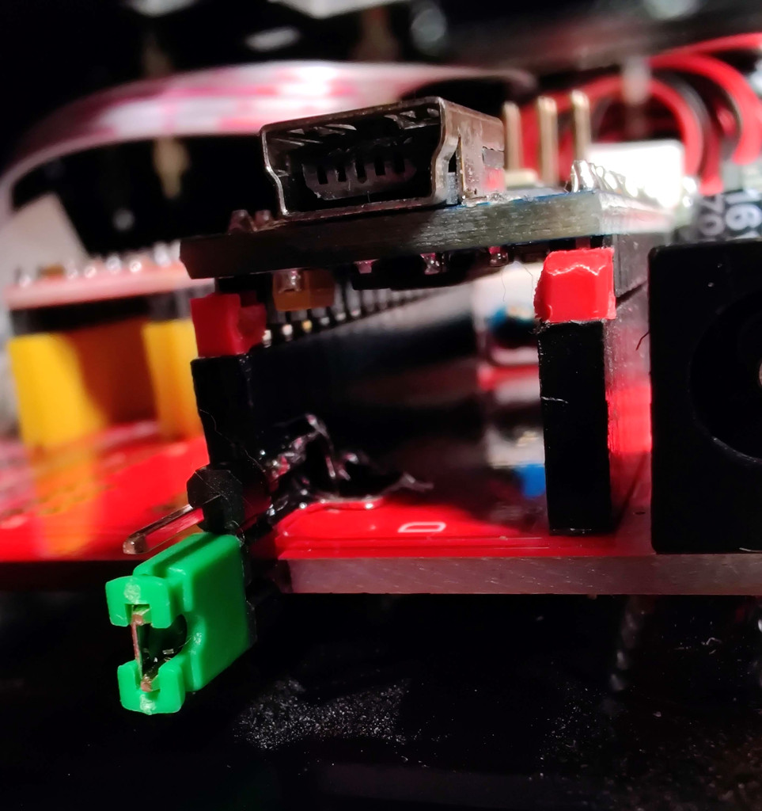

# Laser Cube

This project is just personal notes in an attempt to revive a Laser Cube from my local fablab Openfab.

## [Original resources](original_resources/README.md)

First step is archeology... Finding as much info as I can from the original project, mostly with the invaluable help of www.archive.org. See [original resources](original_resources/README.md).

## Hardware

* Working area 4.2 x 4.2 cm

Even if the Laser Cube was supposed to be open source, we didn't find any schematics, PCB layout, hardware explanations or even properly configured firmware sources. So we dismantled the PCB board and looked at it.


* NANO DCCduino Atmega368p
  * beware there are more pins on the support than on the Arduino module. It must be plugged closer to the center of the board, leaving a row of unpopulated headers on the edge of the PCB
  * USB: CH341 UART `/dev/ttyUSB0` 57600 bauds when programming, 9600 or 115200 bauds with Grbl, see `config.h`.
* Power In 7.5-12V
  * LED indicator in series with R1 2k ohms
  * D-SUN step down from Power In 7.5-12V to 5V
* Laser 100mw 405nm Violet/Blue Focusable Adjustable Laser Dot, Dimensions Ø12mm x 45mm
  * Jumper near D-SUN step down to select 5V or 12V power supply
  * Commanded by its GND
    * Via on/off button (or additional button wired to *weak* header) and R2 26 ohms for low power preview
    * Via *A2SHB* 20V 2.6A continuous, 10A pulsed N-channel MOSFET (room on the PCB for a second MOSFET in //) controlled by Arduino D12
* X & Y axis "stepstick" A4988 Steppers (room for a Z axis stepper)
  * Each has a DIP switch to control step resolution by bringing selectively 5V on MS1/MS2/MS3 when *on*. Leave them all *on* to specify 1/32 microsteps.
  * *X step* connected to Arduino D2
  * *Y step* connected to Arduino D3
  * *Z step* connected to Arduino D4
  * *X dir* connected to Arduino D5
  * *Y dir* connected to Arduino D6
  * *Z dir* connected to Arduino D7
  * *X/Y/Z enable* connected to Arduino D8
* 2 5V connectors for the fans
* unpopulated headers
  * **weak** for button to activate laser at low power, in // with the existing button
  * **resume** for button to connect Arduino A2 and GND
  * **hold** for button to connect Arduino A1 and GND
  * **abort** for button to connect Arduino A0 and GND
  * **D12** to connect Arduino D12 and GND (triggers the laser)
  * **D13** to connect Arduino D13 and GND (can be used by Grbl as spindle direction/enable pin or coolant pin)
  * **X+/X-/Y+/Y-/Z+/Z-** to connect Arduino D9 and GND for normally-open endstops

After cross-checking with Grbl `config.h`, it appears that the Laser Cube PCB follows the default pinout, but in its older version where laser is controlled via D12, while modern Grbl drives it through D11 to get PWM.

## Grbl

So the Grbl versions used for the Laser Cube seem to be now at https://github.com/grbl/grbl/ while more recent versions are available at https://github.com/gnea/grbl .

Some G-Code explanations are available on [Shapeoko wiki](https://wiki.shapeoko.com/index.php/G-Code)

### [Old Grbl versions](notes_old_grbl.md)


### Grbl v1.1

From https://github.com/gnea/grbl

* https://github.com/gnea/grbl/wiki/Compiling-Grbl
  * Install `avr-gcc` and `arduino` packages
  * Usage baudrate is configured in `config.h`, 115200 for v1.1h
  * Flashing baudrate is 57600
* https://github.com/gnea/grbl/wiki/Connecting-Grbl
  * **Beware:** Grbl v0.8 (and Laser Cube PCB) use D12 for laser control while new Grbl 0.9+ use D11 to allow PWM. Comment `//#define VARIABLE_SPINDLE` on Grbl 0.9+ to enable old mapping with D12.
* https://github.com/gnea/grbl/wiki/Grbl-v1.1-Laser-Mode
  * Only when using D11 and `VARIABLE_SPINDLE`
  * To Enable: Send Grbl a `$32=1` command.
  * Grbl controls laser power by varying the 0-5V voltage from the spindle PWM D11 pin. 0V should be treated as disabled, while 5V is full power.
  * The laser is enabled with the M3 spindle CW and M4 spindle CCW commands
  * M3 Constant Laser Power Mode: for heavy cut, for focusing
  * M4 Dynamic Laser Power Mode: faster, ok for engraving. On only during movement, safer.
  * M5 off
  * Example: G0 M3 S1000 will not turn on the laser, but will set the laser modal state to M3 enabled and power of S1000. A following G1 command will then immediately be set to M3 and S1000.
* https://github.com/gnea/grbl/wiki/Two-Axis-System-Considerations
  * Notes to disable Z, makes only sense if we install X/Y endstops...
* https://github.com/gnea/grbl/wiki/Grbl-v1.1-Interface
  * Interface protocol
  * ctrl-x for soft reset
* https://github.com/gnea/grbl/wiki/Grbl-v1.1-Configuration
  * For `$` settings

At time of writing, master is 3 minor commits above tag v1.1h.20190825
```
git checkout master
# enable old D12 laser control pin assignment
sed -i '/^#define.VARIABLE_SPINDLE/s#^#//#' grbl/config.h
make clean
make
avrdude -c arduino -P /dev/ttyUSB0 -b 57600 -p atmega328p -B 10 -U flash:w:grbl.hex:i
screen /dev/ttyUSB0 115200
$RST=*
$$
$3=1
$100=72
$101=72
$110=300
$111=300
$120=100
$121=100
```

* `$3=1` to invert X axis direction
* `$100=72` and `$101=72` X \& Y axis steps/mm (empirical)
* `$110=300` and `$111=300` mm/sec: max speed (and G0 feed). At 400-500, Y axis makes noise in one direction
* `$120=100` and `$121=100` mm/sec^2: acceleration can be high as we always use slow speeds

Homing: (0,0) in the left bottom of the material -> using only positive positions

* Focus your laser on the target material
* Gently use your hand push the X axis to the end of *left* hand side. 
* The Y is *pushed* all the way to the back away from you. 
* Issue `G92 X0 Y0` to set the zero

## Tips

Surface is slippery and when Y axis moves, material may shift. Fix material or use e.g. a rubber sheet.

Online GCode preview : https://ncviewer.com/

[Examples](examples) are from the original Laser Cube examples, but converted to positive positions and completed with zero positioning and G1 feed setting. *Tests ongoing*

## Enabling PWM laser mode

Recent Grbl supports PWM but this requires some changes on the PCB.
To allow both old and new modes, we will add a jumper to wire the laser MOSFET gate to either D12 or D11. This requires cutting the track starting from D12 and scratching the track below and above the cut..



Make sure to test with a multimeter that there is no remaining bridge in the cut between D12 and laser track.

Now depending on the jumper position, we can try the new mode (jumper positioned across the PCB board).

This requires recompiling the firmware with `VARIABLE_SPINDLE` defined.

```
git checkout master
# enable new D11 laser control pin assignment
sed -i '/^\/\/#define.VARIABLE_SPINDLE/s#^\/\/##' grbl/config.h
make clean
make
avrdude -c arduino -P /dev/ttyUSB0 -b 57600 -p atmega328p -B 10 -U flash:w:grbl.hex:i
screen /dev/ttyUSB0 115200
$RST=*
$$
$3=1
$100=72
$101=72
$110=300
$111=300
$120=100
$121=100
$32=1
```
Last line is new and is there to activate the laser mode.

See https://github.com/gnea/grbl/wiki/Grbl-v1.1-Laser-Mode for usage

## TODO

* Can existing laser be driven at 12V ?

