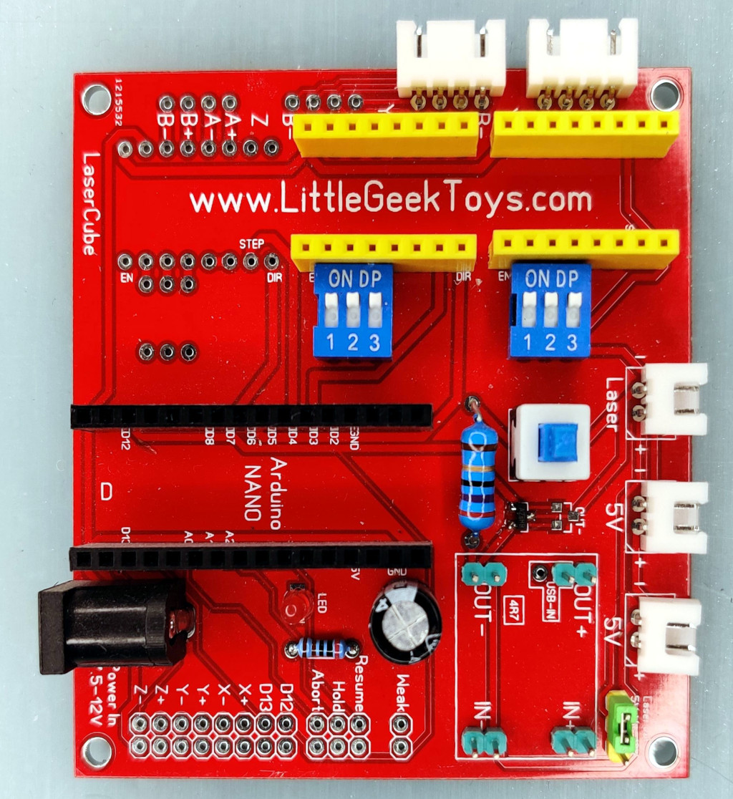

# Laser Cube

This project is just personal notes in an attempt to revive a Laser Cube from my local fablab Openfab.

## [Original resources](original_resources/README.md)

First step is archeology... Finding as much info as I can from the original project, mostly with the invaluable help of www.archive.org. See [original resources](original_resources/README.md).

## Hardware

* Working area 4.2 x 4.2 cm

Even if the Laser Cube was supposed to be open source, we didn't find any schematics, PCB layout, hardware explanations or even properly configured firmware sources. So we dismantled the PCB board and looked at it.



* NANO DCCduino Atmega368p
  * beware there are more pins on the support than on the Arduino module. It must be plugged closer to the center of the board, leaving a row of unpopulated headers on the edge of the PCB
  * USB: CH341 UART `/dev/ttyUSB0` 57600 bauds when programming, 9600 or 115200 bauds with Grbl, see `config.h`.
* Power In 7.5-12V
  * LED indicator in series with R1 2k ohms
  * D-SUN step down from Power In 7.5-12V to 5V
* Laser 100mw 405nm Violet/Blue Focusable Adjustable Laser Dot, Dimensions Ø12mm x 45mm
  * Jumper near D-SUN step down to select 5V or 12V power supply
  * Commanded by its GND
    * Via on/off button (or additional button wired to *weak* header) and R2 26 ohms for low power preview
    * Via *A2SHB* 20V 2.6A continuous, 10A pulsed N-channel MOSFET (room on the PCB for a second MOSFET in //) controlled by Arduino D12
* X & Y axis "stepstick" A4988 Steppers (room for a Z axis stepper)
  * Each has a DIP switch to control step resolution by bringing selectively 5V on MS1/MS2/MS3 when *on*. Leave them all *on* to specify 1/32 microsteps.
  * *X step* connected to Arduino D2
  * *Y step* connected to Arduino D3
  * *Z step* connected to Arduino D4
  * *X dir* connected to Arduino D5
  * *Y dir* connected to Arduino D6
  * *Z dir* connected to Arduino D7
  * *X/Y/Z enable* connected to Arduino D8
* 2 5V connectors for the fans
* unpopulated headers
  * **weak** for button to activate laser at low power, in // with the existing button
  * **resume** for button to connect Arduino A2 and GND
  * **hold** for button to connect Arduino A1 and GND
  * **abort** for button to connect Arduino A0 and GND
  * **D12** to connect Arduino D12 and GND (triggers the laser)
  * **D13** to connect Arduino D13 and GND (can be used by Grbl as spindle direction/enable pin or coolant pin)
  * **X+/X-/Y+/Y-/Z+/Z-** to connect Arduino D9 and GND for normally-open endstops

## Grbl

So the Grbl versions used for the Laser Cube seem to be now at https://github.com/grbl/grbl/ while more recent versions are available at https://github.com/gnea/grbl .

Some G-Code explanations are available on [Shapeoko wiki](https://wiki.shapeoko.com/index.php/G-Code)

### Compilation

See https://github.com/gnea/grbl/wiki/Compiling-Grbl

* Edit `config.h`, possibly removing `cpu_map.h` and `defaults.h` includes and copying them at the end of `config.h` if they need tuning.
* Install `avr-gcc` and `arduino` packages

```
make clean
make grbl.hex
avrdude -c arduino -P /dev/ttyUSB0 -b 57600 -p atmega328p -B 10 -U flash:w:grbl.hex:i
screen /dev/ttyUSB0 115200
```

### Connect
According to `config.h`:
Old Grbl versions: `screen /dev/ttyUSB0 9600`  
New Grbl versions: `screen /dev/ttyUSB0 115200`

### Grbl v1.1

From https://github.com/gnea/grbl

* https://github.com/gnea/grbl/wiki/Connecting-Grbl
  * **Beware:** Grbl v0.8 (and Laser Cube PCB) use D12 for laser control while new Grbl 0.9+ use D11 to allow PWM. Comment `//#define VARIABLE_SPINDLE` on Grbl 0.9+ to enable old mapping with D12.

* https://github.com/gnea/grbl/wiki/Grbl-v1.1-Laser-Mode
  * Only when using D11 and `VARIABLE_SPINDLE`
  * To Enable: Send Grbl a `$32=1` command.
  * Grbl controls laser power by varying the 0-5V voltage from the spindle PWM D11 pin. 0V should be treated as disabled, while 5V is full power.
  * The laser is enabled with the M3 spindle CW and M4 spindle CCW commands
  * M3 Constant Laser Power Mode: for heavy cut, for focusing
  * M4 Dynamic Laser Power Mode: faster, ok for engraving. On only during movement, safer.
  * M5 off
  * Example: G0 M3 S1000 will not turn on the laser, but will set the laser modal state to M3 enabled and power of S1000. A following G1 command will then immediately be set to M3 and S1000.
* https://github.com/gnea/grbl/wiki/Two-Axis-System-Considerations
  * Notes to disable Z, makes only sense if we install X/Y endstops...

**So far, tests failed:**
  * On `G0 X1`, X axis moves very briefly, then Arduino is totally unresponsive, ctrl-x fails, must be hard reset.

Trying to get back to an older version to get sth working...

### Grbl v0.7 test

From https://github.com/grbl/grbl

```
git checkout -b v0_6 origin/v0_6
make
-> compilation error
```

### Grbl v0.7 test

From https://github.com/grbl/grbl

```
git checkout -b v0_7 origin/v0_7
make
avrdude -c arduino -P /dev/ttyUSB0 -b 57600 -p atmega328p -B 10 -U flash:w:grbl.hex:i
screen /dev/ttyUSB0 9600

$0 = 400.000 (steps/mm x)
$1 = 400.000 (steps/mm y)
$2 = 400.000 (steps/mm z)
$3 = 30 (microseconds step pulse)
$4 = 480.000 (mm/min default feed rate)
$5 = 480.000 (mm/min default seek rate)
$6 = 0.100 (mm/arc segment)
$7 = 0 (step port invert mask. binary = 0)
$8 = 25.000 (acceleration in mm/sec^2)
$9 = 0.050 (cornering junction deviation in mm)

G0 X3 Y3
G0 X0 Y0
```
It moves !!

## TODO

* Add a jumper to swap between D12 and D11 for laser and enable Grbl v0.9+ PWM?
* Can existing laser be driven at 12V ?
* Seems to many steps per mm... Try Pocket Laser Engraver config ?
* See how to configure recent Grbl versions...
